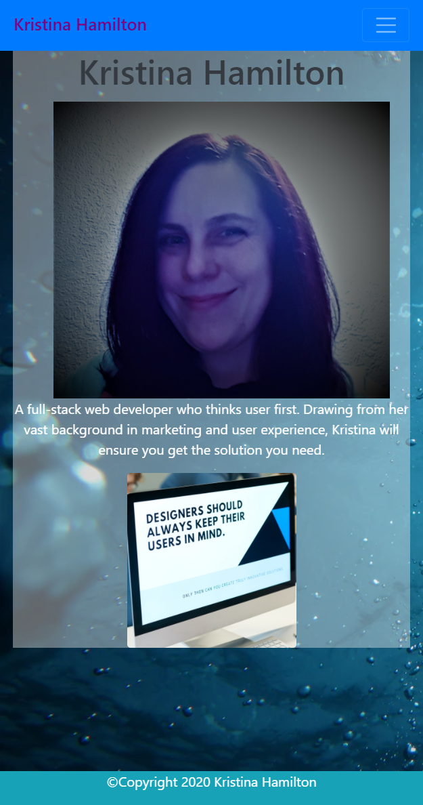
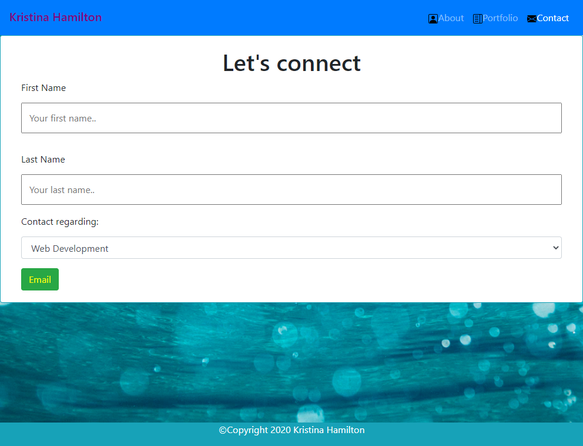

# Responsive Portfolio

## Overview

I created a dynamic and responsive portfolio to showcase my creations, so clients can see how I can get them the solutions they need.

## Dynamic and Responsive Portfolio Expectations

To showcase my wide array of skills and creativity while still being mobile first, Bootstrap was utilized to:

- Create a dynamic Navbar with working links to index.html, portolio.html, and contact.html.
- Grid out and flex a layout that is responsive to varying screen sizes.
- Make the use of media queries unnecessary.
- Use Semantic html to create an easty to navigate page for screen reader users and to optimize SEO.

## Bootstrap and Validation Requirements

1. All HTML and CSS elements have proper semantaics for screen reader users and SEO optimization.
2. CSS used minimally when Bootstrap coding isn't available.
3. Closing tags
5. Functional links
6. Dynamic response to varying screen sizes

## Features Employed on Responsive Portfolio

- Utilized high contrast for viewability.
- JavaScript was used from www.getbootstrap.com to utlilze the dynamic navbar.
- Information from www.w3schools.com was used to create a form with drop down options.
- A clickable button the initiates an email to hamilton.kristina@gmail.com was created with guidance from www.w3schools.com
- Opacity for the cards was changed with advice from ww.stackoverflow.com.
- The <meta name="viewport" content="width=device-width, initial-scale=1, shrink-to-fit=no"> code was used to enable proper scaling across varying devices.
- Bootstrap varying col sizes and flex elements were used for viewing on different screen sizes.
- Bootstrap "img-rounded" employed to give "user" image on index.html and dynamic appearance.
- Bootstrap .svg icons were used on the Navbar to help distinguish the separate links.

## Deployed Responsive Portfolio and Images of Dynamic Sizing

\*[Deployed website](https://kay0s.github.io/Portfolio/)
\*[GitHub Repository](https://github.com/Kay0s/Portfolio)

## Research Resources

- [W3 Schools - Bootstrap Forms](https://developer.mozilla.org/en-US/docs/Learn/Accessibility)
- [stackoverflow - change opacity](https://stackoverflow.com/questions/42430987/how-to-change-the-opacity-of-a-card-block-in-bootstrap-4)
- [GetBootstrop - Bootstrap](https://getbootstrap.com/)
- [W3C - Validator](https://validator.w3.org/)

© 2020 Kristina Hamilton and Trilogy Education Services, a 2U, Inc. brand. All Rights Reserved.
